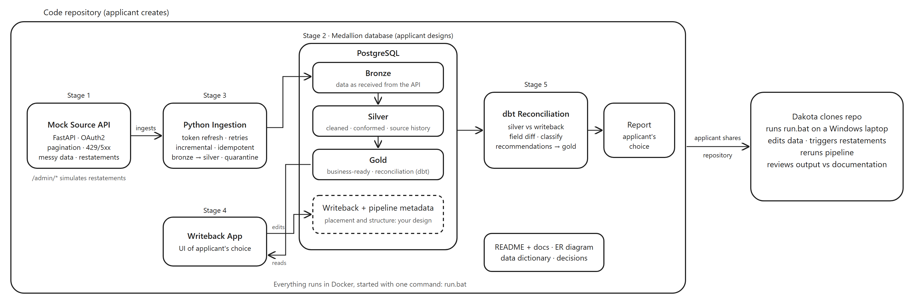

# Dakota Analytics - Python Data Engineering Assessment

## Overview

Build a small data platform: a mock source API generates well production data, you ingest it into a database, users correct it in a writeback app, and a reconciliation model reports what changed against the source and recommends actions. Using AI tooling is fine, just be professional.

## The Challenge



Implement the following components:

### 1. Mock Source API (20 points)
Create a FastAPI service that generates seeded, synthetic oil & gas data: at least 50 wells and 90 days of daily production (`oil_bbl`, `gas_mcf`, `water_bbl`, `uptime_hours`).
- OAuth2 client-credentials auth with expiring tokens
- Paginated endpoints with an `updated_since` filter for incremental loads
- Realistic failures: 429 rate limiting (with `Retry-After`) and random 5xx errors
- Messy data: duplicates, nulls, numbers as strings, nested fields, out-of-range values, mixed date formats
- Admin endpoints to simulate the source changing history:
  - `POST /admin/advance-day`: adds a new day and restates some past records
  - `POST /admin/restate`: changes one specific value (`well_id`, `production_date`, `field`, `value`)
  - `POST /admin/reset`: restores the seeded state

See [api/README.md](api/README.md)

### 2. Database Design (20 points)
Design a PostgreSQL database using a **medallion architecture** (bronze → silver → gold). The design is yours, but it must:
- Keep the data as received from the API
- Store user edits separately from source data, with an audit trail
- Keep the history of source values, so you can tell what the source said when an edit was made
- Hold pipeline metadata (run log, watermarks, rejected records)

Include initialization scripts, an ER diagram and a data dictionary.
See [database/README.md](database/README.md)

### 3. Data Ingestion (20 points)
Build a Python client that loads the API data into your database.
- Token refresh when it expires mid-run
- Retries with backoff for 429/5xx
- Incremental and idempotent loads
- Cleaning, deduplication and type handling, with bad records quarantined
- Logging

See [ingestion/README.md](ingestion/README.md)

### 4. Writeback App (20 points)
Build a web app (framework of your choice) where a user can browse, filter and edit production values and well status.
- Each edit captures who made it and why
- Validation (no negative volumes, uptime between 0 and 24 hours)
- Show the current source value next to the edited value
- Edits can be reverted, and they survive re-ingestion
- The app never modifies source data

See [app/README.md](app/README.md)

### 5. Reconciliation Model (20 points)
Use dbt to compare source data with writeback data:
- An effective view: source data with the active edits applied
- A field-level diff of every edit, classified as:

| Classification | Meaning |
|---|---|
| `override` | The edit differs from the source, and the source hasn't changed since the edit |
| `source_caught_up` | The source changed after the edit and now matches it |
| `conflict` | The source changed after the edit to a different value |

- At least four recommendation rules (e.g. retire an edit, review a conflict, flag high-impact changes)
- Data quality tests
- A report of your choice

See [dbt/README.md](dbt/README.md) and [reports/README.md](reports/README.md)

## Deliverables

### Required Structure

```
your-repo/
├── README.md              # Update with setup instructions
├── docker-compose.yml     # All services defined
├── run.bat                # Windows startup script (see below)
├── .env.example           # Environment variables template
│
├── api/                   # Mock source API
├── database/              # Schema and init scripts
├── ingestion/             # Data ingestion client
├── app/                   # Writeback app
├── dbt/                   # dbt project
├── reports/               # Report generation
│
├── docs/                  # YOUR DOCUMENTATION
│   ├── architecture.md    # System architecture and design
│   ├── decisions.md       # Technical decisions and rationale
│   ├── er_diagram.md      # Database schema diagram
│   └── data_dictionary.md # Tables and columns
│
└── tests/                 # Your tests
```

### Documentation (in `/docs/`)

**`docs/architecture.md`**
- System design overview
- Data flow, including how edits and source restatements interact
- Scalability considerations

**`docs/decisions.md`**
- Key technical and database design decisions
- Trade-offs and alternative approaches
- Rationale for choices

### Startup Script Requirements

**Create `run.bat` that runs the whole application on a Windows laptop with only Docker Desktop installed.** Running it with no arguments must:

1. Set up the environment (`.env` file, build containers)
2. Start all services via docker-compose
3. Run the pipeline end-to-end (ingestion → dbt → report)
4. Open the writeback app in the browser
5. Provide clear output of what's happening

Also support `run.bat pipeline` (re-run ingestion and reconciliation), `run.bat test`, `run.bat stop` and `run.bat clean`.

The script should be idempotent and handle:
- First-time setup
- Subsequent runs
- Basic error handling

We will evaluate your solution by running this script on a clean Windows laptop. Include usage instructions in your README.

## Evaluation Criteria

- **Technical Excellence (40%)** - Code quality, error handling, testing, data integrity
- **Architecture & Design (30%)** - Database design, tool choices, separation of concerns
- **Documentation (20%)** - Clarity, completeness, decision rationale
- **Innovation (10%)** - Creative solutions, useful recommendations, additional value

## Time Expectation

Approximately 6-8 hours. Focus on quality and demonstrating best practices.

## Submission

1. Create your own repository from this one
2. Implement your solution
3. Test that `run.bat` works in a clean environment
4. Email your repository URL to: **technical-assessment@dakotaanalytics.com**

Include in your email:
- Your name
- Repository link (should be public)
- Brief summary of your approach

See [SUBMISSION.md](SUBMISSION.md) for the checklist.

## Questions?

For clarification on requirements only: **technical-assessment@dakotaanalytics.com**

We can clarify requirements but won't help with implementation decisions - that's what we're evaluating!
